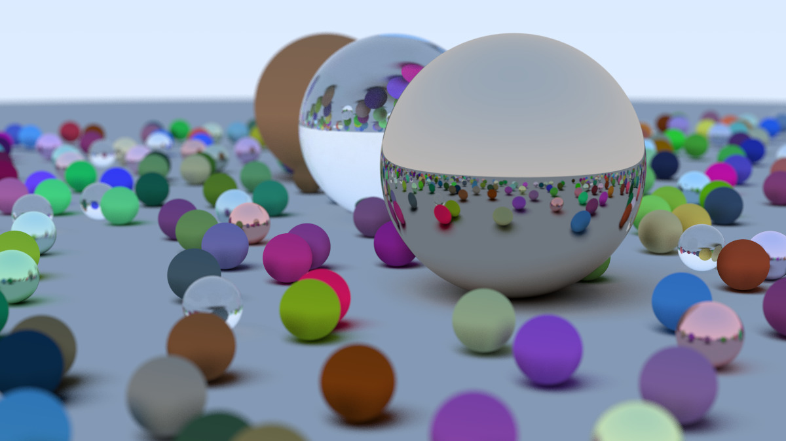
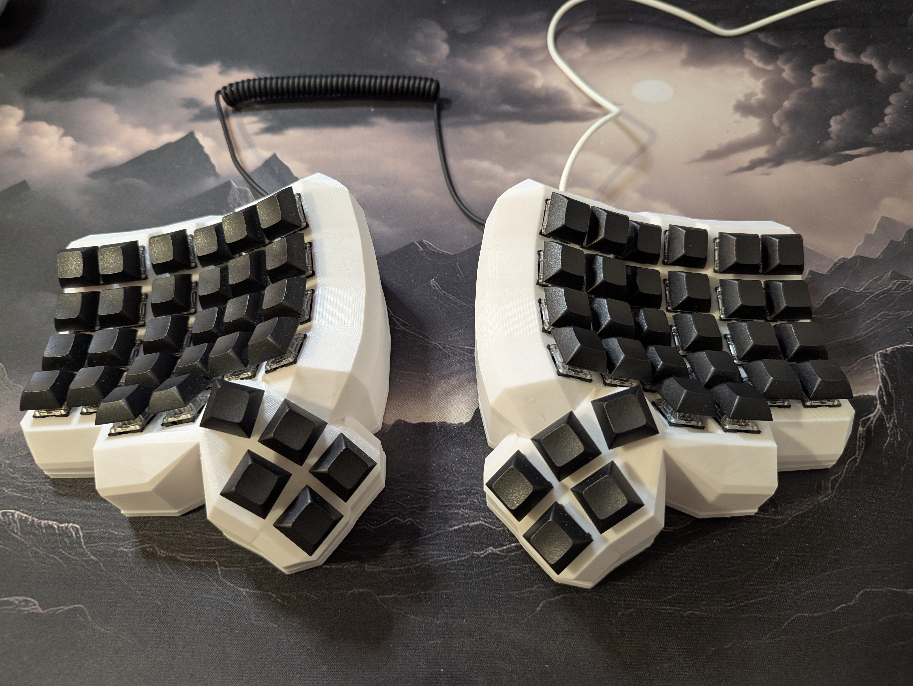

### Hey 👋, I'm Chris

I'm **Chris Cruz**, a **Full Stack Software Engineer** based in Dallas, Texas. I originally came from a **Data Analyst / Data Engineer** background and gradually transitioned into software development after discovering how much I enjoyed writing code to solve problems.

Since then, I’ve worked with **Java**, **TypeScript**, **Python**, **SQL**, and **AWS** across various full stack projects — from internal tools to scalable backend services. Lately, I’ve been diving into systems programming and experimenting with **Rust** through side projects and smaller tools.

I’m currently a Full Stack Software Engineer at **QSRSoft**, sharpening my skills on **LeetCode** [👨🏽‍💻 @LeetCode](https://leetcode.com/christopher-cruz/), and I’d love to work more with **Rust**, **C++**, or **Kotlin** in my next role.

---

### 🔦 Featured Project

🖼️ [**Ray Tracing in One Weekend (Rust)**](https://github.com/christopherc1331/ray_tracing_in_one_weekend)  
A fully working ray tracer built from scratch in Rust. This project was a deep dive into rendering, math-heavy graphics programming, and performance-tuned design.  
_Final render shown below took ~55 minutes running off of CPU._

---

### 🧠 Fun Dev Facts

- I daily drive **Linux** (btw 😄)
- My main keyboard is a **Dactyl Manuform** — fully split, columnar, with no labels.

  

---

  

**What's New:**

<!-- -🌱 I'm currently building a side project \([seekr.ink](https://seekr.ink)\) in Kotlin, SolidJS, and MySQL -->
- 🌱 I'm currently building a tattoo artist discovery side project in Rust, WASM, Leptos, and SQLite
- 🤔 Interests: backend API/service development, frontend with SolidJS, and database-heavy apps
- 💼 I received my endorsement from Lambda School in 2020
- 💬 Reach out if you'd like to connect or swap stories about dev journeys
- 📫 Email me at christopherc1331@gmail.com
<!-- - 📝 See my [Portfolio](http://www.ccruz.engineer) to get more info. -->

---

### 🛠️ Languages and Tools

<code></code>
<code></code>
<code></code>
<code></code>
<code></code>
<code></code>
<code></code>
<code></code>
<code></code>
<code></code>
<code></code>
<code></code>
<code></code>
<code></code>
<code></code>
<code></code>
<code></code>

---

⭐️ From [christopherc1331](https://github.com/christopherc1331)
